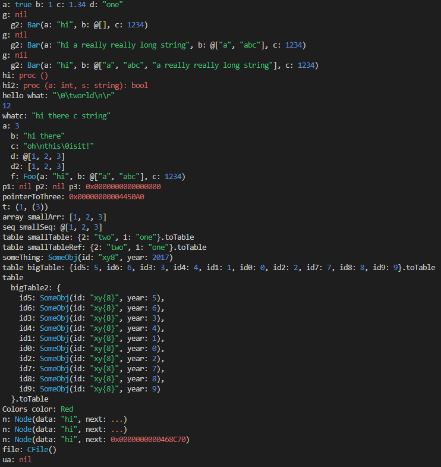
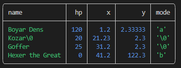

# Pretty - a pretty printer for Nim types.

`nimble install pretty`


[API reference](https://treeform.github.io/pretty)

This library has no dependencies other than the Nim standard library.

This is a rewrite of the now deprecated [print](https://github.com/treeform/print).

## About

Pretty is a powerful and versatile pretty printer library for Nim that allows you to print and display Nim types in a visually appealing and easy-to-read format. With Pretty, you can print your data structures with syntax highlighting, smart indentation, and support for various data types such as tables, sets, JSON, and even procs. It is designed to help you debug and understand your code more efficiently.

```nim
import pretty

let a = 3
print a
```
```nim
a: 3
```

## Features

- **Syntax Highlighting**: Pretty prints your data structures with syntax highlighting, making it visually pleasing and easier to read.
- **Smart Indentation**: If the output exceeds the maximum width of the current terminal, Pretty creates indentation levels for improved readability.
- **Nim-Friendly Output**: The library outputs the data in the exact same format you would use to create it in your Nim source code. You can copy and paste the output back into your code, and it will compile seamlessly in most cases.
- **Handles Complex Types**: Pretty can handle complex types such as references, pointers, cycles, and nils effortlessly.
- **No External Dependencies**: Pretty has no dependencies other than the Nim standard library, ensuring easy integration into your projects.
- **Support for Various Data Types**: Pretty supports common data types like HashTable, HashSet, and JsonNode, printing them neatly without exposing their internal details.
- **Table Printing**: Pretty offers the ability to print data as tables, providing a more natural and intuitive way to display information compared to nested data structures.


## The "Nim way"

Pretty doesn't just print your data structures; it reproduces them in the exact same format you would use to create them in your Nim source code. It's like magic! You can simply copy and paste the output back into your code, and it will compile seamlessly in most cases. This is incredibly cool because as it allows you to retrieve and reproduce the original data effortlessly.

```nim
let
  a = 3
  b = "hi there"
  c = "oh\nthis\0isit!"
  d = @[1, 2, 3]
  d2 = [1, 2, 3]
  f = Foo(a:"hi", b:@["a", "abc"], c:1234)

print a, b, c, d, d2, f
```
```nim
a: 3 b: "hi there" c: "oh\nthis\0isit!" d: @[1, 2, 3] d2: [1, 2, 3] f: Foo(a: "hi", b: @["a", "abc"], c: 1234)
```

## Syntax highlighting

Screenshot from VS Code:



Pretty only applies fancy colors when it detects a terminal. If you pipe the output of your program to a file or another command, it will output plain text.

## Smart indention

Pretty attempts to print everything in a single line, but if the output exceeds the maximum width of the current terminal, it will create indentation levels for improved readability. The maximum width is determined based on the maximum width of the current terminal.

```nim
let g2 = Bar(a: "hi a really really long string", b: @["a", "abc"], c: 1234)
print g2
```

```nim
g2: Bar(
  a: "hi a really really long string",
  b: @["a", "abc"],
  c: 1234
)
```

## Stuff `echo` does not do well

If you've used Nim before, you know that printing `ref object`s is a real pain. Nim will complain that there's no `$` operator, even though it already knows how to print them. And even if you do create a `$` operator for your `ref object`, you still have to handle nils and cycles yourself!

That's where pretty comes in. It can print `nil`s, `ref`s, and `pointer`s.

```nim
g2=Bar(
  a: "hi a really really long string",
  b: @["a", "abc"],
  c: 1234
)
```

```nim
let
  p1: ptr int = nil
  p2: ref Foo = nil
print p1, p2
```
```nim
p1: nil p2: nil
```

```nim
var three = 3
var pointerToThree = cast[pointer](addr three)
print pointerToThree
```
```nim
pointerToThree: 0x00000000004360A0
```

```nim
type Node = ref object
  data: string
  next: Node
var n = Node(data:"hi")
n.next = n
print n
```
```nim
n: Node(data: "hi", next: ...)
```

## Pretty also does Tables, Sets and even Json!

You got that straight! Pretty is fully aware of common data types like `HashTable`, `HashSet`, and `JsonNode`, which often print out in a messy manner, exposing their internal details. . No ugly internals to be found here!

```nim
let json = %*{
  "a": 123,
  "b": "hi",
  "c": true
}
print json
```

```nim
json: {a: 123, b: "hi", c: true}
```

## It also does `procs`

```nim
proc adder(a, b: int): int = a + b
print adder
```
```nim
adder: proc (a: int, b: int): int
```

## Pretty tables

Pretty also has the ability to print data as tables, which can often be a more natural and intuitive way to display information compared to nested data structures. Pretty cool!

```nim
type
  Mob = object
    name: string
    hp: int
    x: float
    y: float
    mode: char
var mobs = @[
  Mob(name:"Boyar Dens", hp: 120, x:1.2, y:2.33333, mode:'a'),
  Mob(name:"Kozar\0", hp: 20, x:21.23, y:2.3),
  Mob(name:"Goffer", hp: 25, x:31.2, y:2.3),
  Mob(name:"Hexer the Great", hp: 0, x:41.2, y:122.3, mode:'b'),
]
printTable mobs
```


